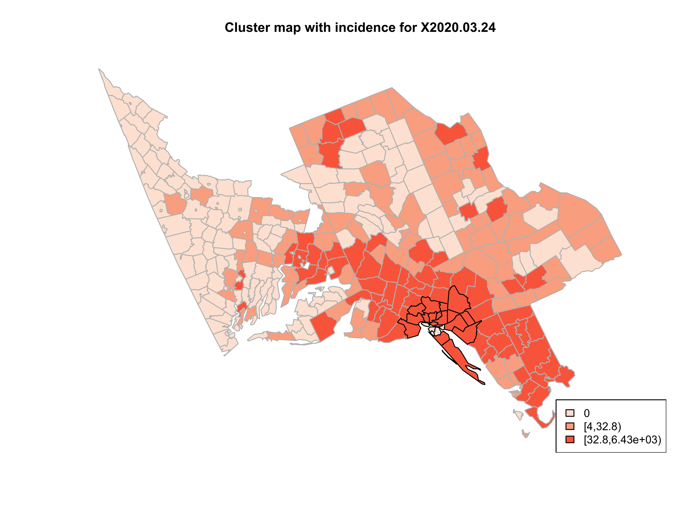

# SCANPLOT

Jaeseon Lee

For spatial analysis, Kulldorff's (1997) scan statistics is a typical statistic for cluster detection. The package '*scanplot*' **harnesses scan statistics** to efficiently detect spatial and temporal patterns in spatio-temporal datasets, with automatic distribution selection based on zero case prevalence. On top of that, the package includes **a specialized plotting function** for visualizing spatial clusters identified by the scan statistics across various temporal domains. This comprehensive toolkit offers users a streamlined solution for robust analyses and clear visualizations of spatio-temporal patterns in their data.

We assumed a Zero-inflated Poisson distribution if the zero cases exceed 30% of the total, and the Poisson distribution, otherwise. Also, the maximum size of the scanning windows is set to 50%.

## Installation

To install '*scanplot*' package, use the following code into your R console:

``` r
library(devtools)
devtools::install_github("jaeseonlee/scanplot")
```

## Usage

To use '*scanplot*' package, use the following code into your R console:

``` r
library(scanplot)
```

*'scanplot'* consists of two functions: *scan_seq()* and *scan_plot()*.

### 1. scan_seq()

*scan_seq* is a function that apply Kulldorff's scan statistics to detect spatial and temporal patterns in the data at each time point, facilitating cluster detection.

Here's the example for this function:

``` r
# Load the data
data(covid_US)
data(shp_name)
data(centroid)
```

After loading data, implement spatial scan statistics. It is required to assign appropriate working directory for "save = TRUE", which enables to save the result of scan statistics as csv and txt file.

``` r
# Implement spatial scan statistics
# Assign appropriate working directory before "save = TRUE"
# setwd('your working directory')
id <- scan_seq(data = covid_US, shp.name = shp_name, centroid = centroid,
               pop.upper.bound = .2, n.simulations = 999, alpha.level = .05, save = FALSE)
```

As a result, the following list can be obtained. For the first element of resulted list, NULL indicates that there is no detected spatial cluster on the first week. The second element of the list shows detected spatial group for the second week (2020.03.24 - 2020.03.30).

``` r
head(id, 2)

#> [[1]]
#> NULL
#> 
#> [[2]]
#>           week       state      county No_of_cases    RR Exp.cases pvalue total cluster.cases percent shp.order
#> 18 X2020.03.24 Connecticut   Fairfield        1175 10.74   2673.77  0.001 43035         28721   66.74        44
#> 6  X2020.03.24  New Jersey      Hudson        1124 10.74   2673.77  0.001 43035         28721   66.74        94
#> 8  X2020.03.24  New Jersey      Bergen        1873 10.74   2673.77  0.001 43035         28721   66.74        81
#> 9  X2020.03.24  New Jersey       Essex        1291 10.74   2673.77  0.001 43035         28721   66.74        89
#> 10 X2020.03.24  New Jersey       Union        1024 10.74   2673.77  0.001 43035         28721   66.74       104
#> 13 X2020.03.24  New Jersey     Passaic         950 10.74   2673.77  0.001 43035         28721   66.74        73
#> 14 X2020.03.24  New Jersey   Middlesex         913 10.74   2673.77  0.001 43035         28721   66.74       113
#> 15 X2020.03.24  New Jersey    Monmouth         792 10.74   2673.77  0.001 43035         28721   66.74       116
#> 16 X2020.03.24  New Jersey      Morris         543 10.74   2673.77  0.001 43035         28721   66.74        83
#> 17 X2020.03.24  New Jersey    Somerset         282 10.74   2673.77  0.001 43035         28721   66.74        99
#> 1  X2020.03.24    New York      Queens           0 10.74   2673.77  0.001 43035         28721   66.74        95
#> 2  X2020.03.24    New York       Kings           0 10.74   2673.77  0.001 43035         28721   66.74       102
#> 3  X2020.03.24    New York    New York           0 10.74   2673.77  0.001 43035         28721   66.74        91
#> 4  X2020.03.24    New York       Bronx           0 10.74   2673.77  0.001 43035         28721   66.74        86
#> 5  X2020.03.24    New York      Nassau        4902 10.74   2673.77  0.001 43035         28721   66.74        88
#> 7  X2020.03.24    New York    Richmond           0 10.74   2673.77  0.001 43035         28721   66.74       110
#> 11 X2020.03.24    New York Westchester        6432 10.74   2673.77  0.001 43035         28721   66.74        66
#> 12 X2020.03.24    New York    Rockland        1919 10.74   2673.77  0.001 43035         28721   66.74        68
#> 19 X2020.03.24    New York      Putnam         122 10.74   2673.77  0.001 43035         28721   66.74        58
#> 20 X2020.03.24    New York     Suffolk        4333 10.74   2673.77  0.001 43035         28721   66.74        98
#> 21 X2020.03.24    New York      Orange        1046 10.74   2673.77  0.001 43035         28721   66.74        50
```

### 2. scan_plot()

*scan_plot()* is a function to plot spatial clusters detected by scan statistics across different temporal domains. Note that this function is useful for plotting the results of scan statistics conducted at "multiple" time points.

Here's the example for this function:

``` r
# Load the required package
library(sf) # st_read
```

``` r
# Load the data
data(covid_US)
data(shp_name)
data(centroid)

shp_US <- sf::st_read(system.file("extdata", "shp_US.shp", package = 'scanplot'))
```

``` r
# Implement spatial scan statistics
# Assign appropriate working directory before "save = TRUE"
# setwd('your working directory')
id <- scan_seq(data = covid_US, shp.name = shp_name, centroid = centroid,
               pop.upper.bound = .2, n.simulations = 999, alpha.level = .05, save = FALSE)
```

``` r
# Assign appropriate working directory before scan_plot()
# setwd('your working directory')
scan_plot(data = covid_US, shp = shp_US, id = id, allmap = FALSE)
```

The first two resulting maps are as follows. The black-bordered line indicate detected spatial group by scan statistics.

{width="700"}

{width="700"}

## Details

For more details on '*scanplot'* package, please access the package documentations. Further, please reach out to the author.
